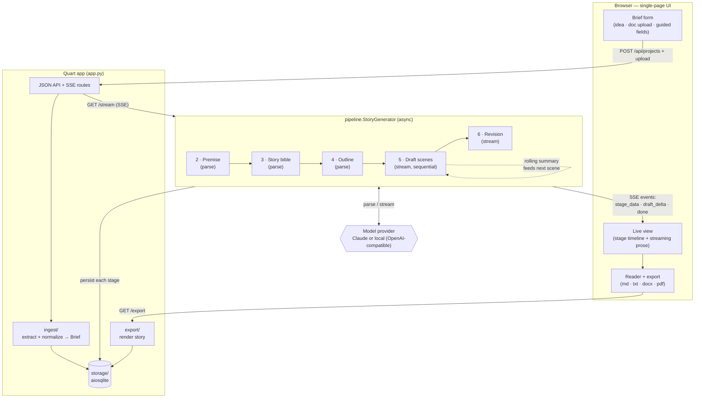

# MuseAI

Turn a creative idea — a few paragraphs, an uploaded document, or a handful of
guided fields — into a complete, coherent story. MuseAI runs a **multi-stage
generation pipeline** so that long-form output keeps consistent characters,
voice, and a real narrative arc, rather than one-shotting a story.

Built with **Quart** (async Python) and **Claude** (`claude-opus-4-8`) via the
official `anthropic` SDK, with live streaming over Server-Sent Events. Each stage
can also run on a **local model** — see [Local models](#local-models).

## How it works



1. **Normalize brief** — merge freeform idea + uploaded doc text + guided fields.
2. **Premise** — title, logline, themes, central conflict (structured output).
3. **Story bible** — POV/tense, setting, and a cast with arcs and distinct voices.
4. **Outline** — an ordered set of scenes sized to the chosen length.
5. **Draft scenes** — written sequentially; each scene gets the (prompt-cached)
   story bible plus a rolling continuity summary of everything written so far.
6. **Revision** — one line-edit/continuity pass over the whole draft.

Progress and prose stream to the browser live; the finished story can be
exported to Markdown, plain text, DOCX, or PDF.

## Setup

```bash
python -m venv .venv && source .venv/bin/activate
pip install -r requirements.txt
cp .env.example .env          # then put your key in ANTHROPIC_API_KEY
```

## Run

```bash
hypercorn app:app --bind localhost:8000
# or: python app.py
```

Open <http://localhost:8000>, describe an idea, optionally upload a `.txt` /
`.md` / `.docx` / `.pdf` and set genre/tone/length, then **Generate story**.

## Smoke test (optional, uses the API)

```bash
python scripts/smoke.py
```

Runs every stage against a tiny brief and confirms the structured stages parse
and a scene streams.

## Configuration (`.env`)

| Variable | Default | Purpose |
|----------|---------|---------|
| `ANTHROPIC_API_KEY` | — | required only if a stage uses Claude |
| `MUSEAI_PLANNING_PROVIDER` | `anthropic` | `anthropic` or `local` — premise/bible/outline/summary |
| `MUSEAI_DRAFTING_PROVIDER` | `anthropic` | `anthropic` or `local` — scene drafting + revision |
| `MUSEAI_PLANNING_MODEL` | `claude-opus-4-8` | planning model id |
| `MUSEAI_DRAFTING_MODEL` | `claude-opus-4-8` | drafting model id (e.g. `claude-sonnet-4-6` to cut cost) |
| `MUSEAI_LOCAL_BASE_URL` | `http://localhost:11434/v1` | OpenAI-compatible endpoint (Ollama default) |
| `MUSEAI_LOCAL_API_KEY` | `ollama` | placeholder key the SDK requires (most local servers ignore it) |
| `MUSEAI_DB_PATH` | `museai.db` | SQLite file |
| `MUSEAI_HOST` / `MUSEAI_PORT` | `localhost` / `8000` | bind address |

Length presets (scene count + per-scene token budget) live in `config.py`.

## Local models

MuseAI can run any stage against a local **OpenAI-compatible** server — Ollama,
LM Studio, vLLM, or `llama.cpp --server`. Providers are chosen **per stage group**
(planning vs drafting), so you can go fully local or mix Claude and local.

**Fully local with Ollama:**

```bash
ollama pull llama3.1
# in .env:
#   MUSEAI_PLANNING_PROVIDER=local
#   MUSEAI_DRAFTING_PROVIDER=local
#   MUSEAI_PLANNING_MODEL=llama3.1
#   MUSEAI_DRAFTING_MODEL=llama3.1
hypercorn app:app --bind localhost:8000   # no ANTHROPIC_API_KEY needed
```

**Mixed — Claude plans, local model writes prose** (a good balance: the
structured planning stages stay reliable, drafting runs free/offline):

```bash
#   MUSEAI_PLANNING_PROVIDER=anthropic
#   MUSEAI_DRAFTING_PROVIDER=local
#   MUSEAI_DRAFTING_MODEL=llama3.1
```

Point at a different runtime by changing `MUSEAI_LOCAL_BASE_URL` (e.g. LM Studio
`http://localhost:1234/v1`, vLLM `http://localhost:8000/v1`). The active providers
are shown as a badge in the app header.

**Notes**
- The structured planning stages (premise / bible / outline) need valid JSON.
  MuseAI requests schema-constrained output and falls back to JSON-mode +
  prompt + a repair retry, but small models can still struggle — prefer a capable
  instruct model (e.g. `llama3.1`, `qwen2.5`, `mistral-nemo`) for planning, or
  keep planning on Claude.
- Prefer a non-reasoning instruct model for **drafting**: models that emit
  `<think>…</think>` will stream that reasoning into the prose.

## Layout

```
app.py            Quart routes (SPA + JSON API + SSE)
config.py         settings + length presets
pipeline/         schemas, prompts, llm (provider backends), per-stage calls, generator
ingest/           document text extraction + brief normalization
storage/          aiosqlite persistence
export/           md / txt / docx / pdf rendering
templates/ static/  single-page UI
scripts/smoke.py  end-to-end pipeline check
```

## Not in this MVP

Accounts/auth, a multi-user saved library, billing/usage metering, single-scene
regeneration, and parallel scene drafting (kept sequential for continuity).
