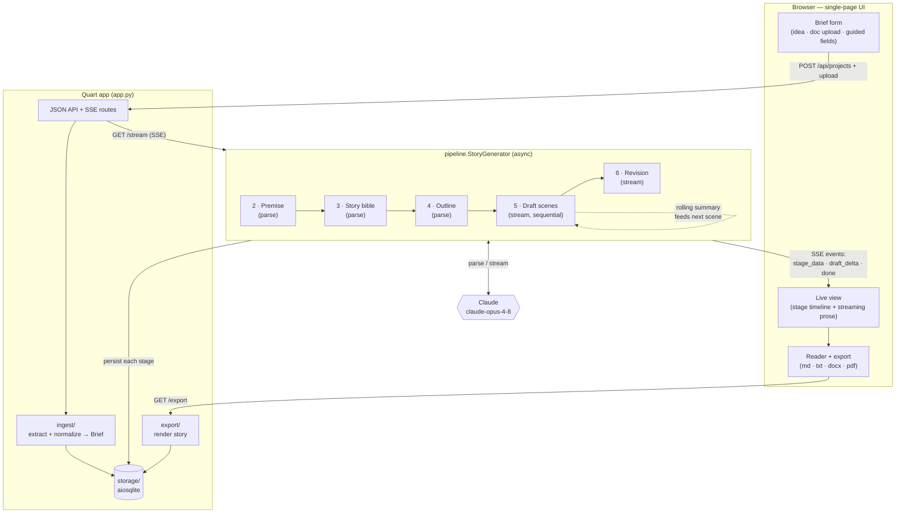

# MuseAI

Turn a creative idea — a few paragraphs, an uploaded document, or a handful of
guided fields — into a complete, coherent story. MuseAI runs a **multi-stage
generation pipeline** so that long-form output keeps consistent characters,
voice, and a real narrative arc, rather than one-shotting a story.

Built with **Quart** (async Python) and **Claude** (`claude-opus-4-8`) via the
official `anthropic` SDK, with live streaming over Server-Sent Events.

## How it works



1. **Normalize brief** — merge freeform idea + uploaded doc text + guided fields.
2. **Premise** — title, logline, themes, central conflict (structured output).
3. **Story bible** — POV/tense, setting, and a cast with arcs and distinct voices.
4. **Outline** — an ordered set of scenes sized to the chosen length.
5. **Draft scenes** — written sequentially; each scene gets the (prompt-cached)
   story bible plus a rolling continuity summary of everything written so far.
6. **Revision** — one line-edit/continuity pass over the whole draft.

Progress and prose stream to the browser live; the finished story can be
exported to Markdown, plain text, DOCX, or PDF.

## Setup

```bash
python -m venv .venv && source .venv/bin/activate
pip install -r requirements.txt
cp .env.example .env          # then put your key in ANTHROPIC_API_KEY
```

## Run

```bash
hypercorn app:app --bind localhost:8000
# or: python app.py
```

Open <http://localhost:8000>, describe an idea, optionally upload a `.txt` /
`.md` / `.docx` / `.pdf` and set genre/tone/length, then **Generate story**.

## Smoke test (optional, uses the API)

```bash
python scripts/smoke.py
```

Runs every stage against a tiny brief and confirms the structured stages parse
and a scene streams.

## Configuration (`.env`)

| Variable | Default | Purpose |
|----------|---------|---------|
| `ANTHROPIC_API_KEY` | — | required |
| `MUSEAI_PLANNING_MODEL` | `claude-opus-4-8` | premise/bible/outline/summary |
| `MUSEAI_DRAFTING_MODEL` | `claude-opus-4-8` | scene drafting + revision (set to `claude-sonnet-4-6` to cut cost on long stories) |
| `MUSEAI_DB_PATH` | `museai.db` | SQLite file |
| `MUSEAI_HOST` / `MUSEAI_PORT` | `localhost` / `8000` | bind address |

Length presets (scene count + per-scene token budget) live in `config.py`.

## Layout

```
app.py            Quart routes (SPA + JSON API + SSE)
config.py         settings + length presets
pipeline/         schemas, prompts, per-stage Claude calls, generator
ingest/           document text extraction + brief normalization
storage/          aiosqlite persistence
export/           md / txt / docx / pdf rendering
templates/ static/  single-page UI
scripts/smoke.py  end-to-end pipeline check
```

## Not in this MVP

Accounts/auth, a multi-user saved library, billing/usage metering, single-scene
regeneration, and parallel scene drafting (kept sequential for continuity).
